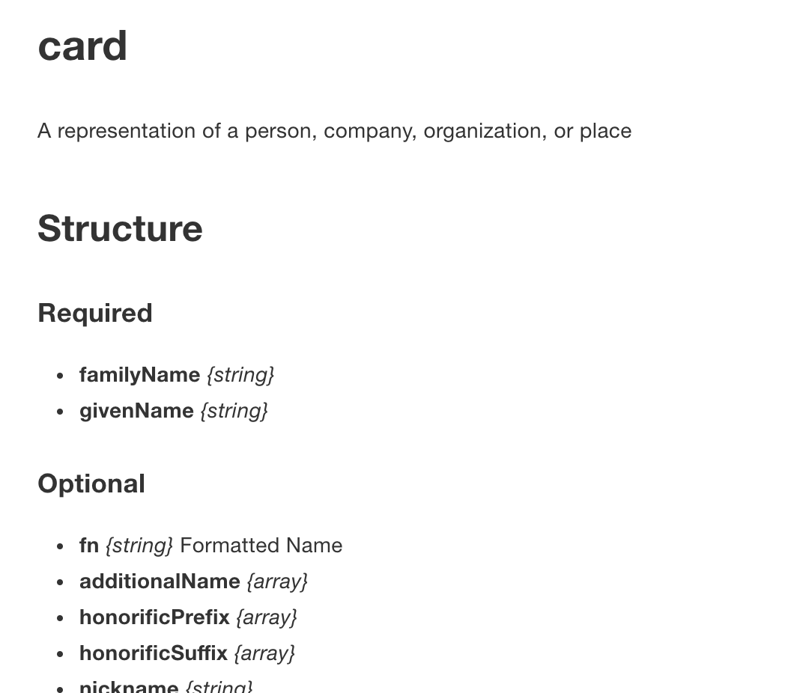
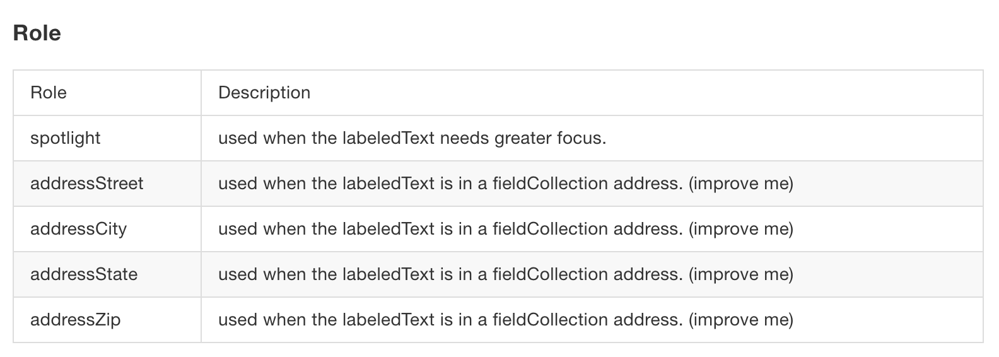

# Gitbook Plugin: JSON-Schema

[](https://github.com/prettier/prettier)
[](https://circleci.com/gh/hipstersmoothie/gitbook-plugin-json-schema/tree/master)
[](https://codecov.io/gh/hipstersmoothie/gitbook-plugin-json-schema)

This plugin for [Gitbook](https://github.com/GitbookIO/gitbook) takes a [JSON-Schema](http://json-schema.org/) and exposes a [block](https://toolchain.gitbook.com/plugins/blocks.html) that matches [ids](http://json-schema.org/latest/json-schema-core.html#id-keyword) to autogenerates docs.

## Usage

Simply provide an id that exists somewhere in your schema.

```md


```

The plugin will generate docs that describe the required and optional properties.



## Configuration

### Schema

The basic configuration requires only a path to your schema definition or the schema itself.

```json
{
  "plugins": ["json-schema"],
  "pluginsConfig": {
    "json-schema": {
      "schema": "http://json-schema.org/example/card.json"
    }
  }
}
```

### Bundled

To properly parse a schema and generate the docs, this plugin requires the entire schema to be bundled into one file with only internal $ref pointers. When this plugin is in the `init` phase it will try to bundle the schema by default. If this schema is large it can take quite awhile to bundle it.

To speed up development you might want to pre-bundle your schema with [JSON-Schema-Ref-Parser](https://github.com/BigstickCarpet/json-schema-ref-parser). If you do this you should also state so in your config:

```json
{
  "pluginsConfig": {
    "json-schema": {
      "bundled": true,
      "schema": "./schema/merged_schema.json"
    }
  }
}
```

### Omit Properties

Globally omit properties that are included in all of your schema.

```json
{
  "pluginsConfig": {
    "json-schema": {
      "omitProperties": [
        "names",
        "of",
        "properties",
        "to",
        "exclude",
        "_comment"
      ],
      ...
    }
  }
}
```

### Plugins

Transform some property in your schema into a more complex UI component. To do this you can map the property key (or path to the key) to a render function. Top level property keys are omitted from the required and optional lists.

**_Note: The plugin code must be ES5._**

```json
{
  "pluginsConfig": {
    "json-schema": {
      "plugins": {
        "modifiers": "./path/to/es5/plugin/modifierTable.js",
        "metaData.properties.role": "./path/to/es5/plugin/roleTable.js"
      },
      ...
    }
  }
}
```

Example Plugin

```js
const roleRow = schema => `
    <tr>
      <td>${schema.const}</td>
      <td>${schema.description}</td>
    </tr>
  `;

const roleTable = ({ oneOf }) => {
  if (!oneOf) return '';

  return `
    <h4>Role</h4>
    <table>
      <thead>
        <tr>
          <td>Role</td>
          <td>Description</td>
        </tr>
      </thead>
      <tbody>
        ${oneOf.map(roleRow).join('')}
      </tbody>
    </table>
  `;
};

export default roleTable;
```

Which generates:



# Contributing / Bug Reporting

I built this to work with simple schemas and a very complex specific schema, so there might be patterns that aren't covered by the plugin. For these cases please file an [Issue](https://github.com/hipstersmoothie/gitbook-plugin-json-schema/issues) or a [Pull Request](https://github.com/hipstersmoothie/gitbook-plugin-json-schema/pulls).
